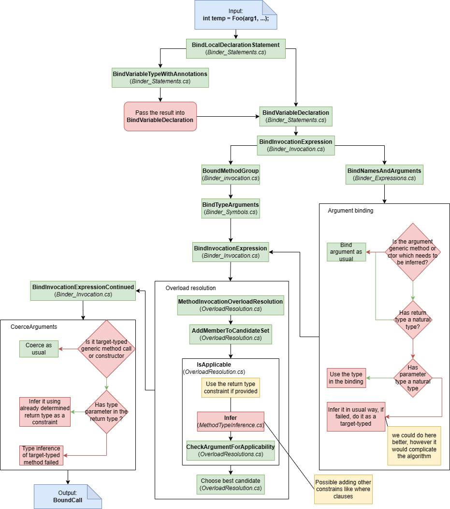
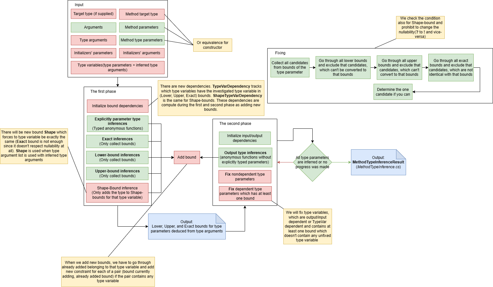

# Next meeting

- Simplified version of the previous inference

## Method type inference



### Examples

> Type hints - simple

```csharp
F1<int, _>("hi"); // Inferred: F1<int, string>(string)
F2<_, _>(1, 1); //  Inferred: F2<int, int>(int, int)
F2<_>(1,1); // Inferred: F2<int>(int,int)
F2(1,1); // Inferred: F2<int>(int,int)
F3<int, _, string, _>(new GC2<byte, short>()); // Inferred: F3<int, byte, string, short>(GC2<byte, short>)
F4<_, _, string>(intVal => intVal + 1, x => x.ToString(),str => str.Length); // Inferred: F4<int, int, string>(Func<int, int>, Func<int, string>, Func<string, int>)
F5((byte)1); // Inferred: F5<byte>(byte)
F5(1); // Inferred: F5(int)
F6<_>(1, new GC1<byte>()); // Inferred: F6<byte>(int p1, params GC1[] args)
F6<_>(1, new GC1<byte>(), new GC1<byte>()); // Inferred: F6<byte>(int p1, params GC1[] args)

//Definitions
void F1<T1, T2>(T2 p2) { }
void F2<T1>(T1 p1, int p2) { }
void F2<T1, T2>(T1 p1, T2 p2) { }
void F3<T1, T2, T3, T4>(GC2<T2, T4> p24) { }
void F4<T1, T2, T3>(Func<T1, T2> p12, Func<T2, T3> p23, Func<T3, T1> p31) { }
void F5<T1>(T1 p1) {}
void F5(int p1) {}
void F6<T>(int p1, params GC1<T>[] args) {}
```

> Type hints - Nullable inference

```csharp

string? temp1 = null;
string temp2 = "";
C2<int, string> temp3 = new C2<int, string>();
C2<int, string?> temp4 = new C2<int, string?>();

F1<int, _>(temp1); // Inferred: F1<int, string>(string?)
F1<int, _>(temp2); // Inferred: F1<int, string>(string?)
F1<int?, _>(temp1); // Inferred: F1<int, string>(string?)
F1<int?, _>(temp2); // Inferred: F1<int, string>(string?)
F2<int, _>(temp1); // Inferred: F2<int, string?>(string?)
F2<int, _>(temp2); // Inferred: F2<int, string>(string)
F2<int?, _>(temp1); // Inferred: F2<int, string?>(string?)
F2<int?, _>(temp2); // Inferred: F2<int?, string>(string)


F<I2<_, string?>>(temp3); // Inferred: F<I2<int, string?>>(C2<int, string?>)
F<C2<_, string?>>(temp3); // Error: Can't infer
F<I2<_, _>>(temp3); // Inferred: F<I2<int, string!>>(C2<int, string!>)
F<C2<_, _>>(temp3); // Inferred: F<C2<int, string!>>(C2<int, string!>)
F<I2<_, _>>(temp4); // Inferred: F<I2<int, string?>>(C2<int, string?>)
F<C2<_, _>>(temp4); // Inferred: F<C2<int, string?>>(C2<int, string?>)
F<I2<_, string>>(temp4); // Error: Can't infer
F<C2<_, string>>(temp4); // Error: Can't infer

// Definitions
void F1<T1, T2>(T2? p2) { }
void F2<T1, T2>(T2 p2) { }
void F<T1>(T1 p1) {}
void F<T1>(T1 p1, T1 p2) {}

class A {}
interface I2<in T1, out T2> {}
class C2<T1, T2> : I2<T1, T2> {}
```

> Type hints - complex 

```csharp
B1<int> temp = new B1<int>();
B2<int, string> temp2 = new B2<int, string>();
C2<int, B> temp3 = new C2<int, B>();

F1<A1<_>>(temp); // Inferred: F1<A1<int>>(A1<int>)
F1<A2<_, string>>(temp2); // Inferred: F1<A2<int, string>>
F1<I2<_, A>>(temp3); // Inferred: F1<I2<int, A>>(I2<int, A>)

//Definitions
void F1<T1>(T1 p1) {}

class A {}
class B : A{}
class A1<T> {}
class A2<T1, T2> {}
class B1<T> : A1<T> {}
class B2<T1, T2> : A2<T1, T2> {}
interface I2<in T1, out T2> {}
class C2<T1, T2> : I2<T1, T2> {}
```

> Target-typed inference

```csharp
int temp1 = Foo1(); // Inferred: Foo1<int>()
IEnumarable<_> temp2 = Foo2(); // Inferred: Foo2<List<int>>()
Bar1(Foo1()); // Inferred: Bar1(Foo1<int>())
Bar2(Foo1(), (List<int>)null) // Inferred: Bar2<int>(Foo1<int>(), (List<int>)null) 
Bar3(Foo2()); // Inference failed because Foo2 is target-typed

//Definitions
T Foo1<T>() {}
List<T> Foo2<T>() {}

void Bar1(int p1) {}
void Bar2<T>(T p1, IEnumerable<T> p2) {}
void Bar3<T>(IEnumerable<T> p1) {}
```

## Contructor type inference


> Type hints - simple
> (It is as strong as in the expression invocation)

```csharp
var temp1 = new GC1<byte>();
new C1<int, _>("hi"); // Inferred: C1<int, string>(string)
new C2<_, _>(1,1); // Inferred: C2<int, int>(int, int)
new C2<_>(1,1); // Inferred: C2<int>(int, int)
new C3<int, _, string, _>(new GC2<byte, short>()); // Inferred: C3<int, byte, string, short>(GC2<byte, short>)
new C4<_, _, string>(intVal => intVal + 1, x => x.ToString(), str => str.Length); // Inferred: C4<int, int, string>(Func<int, int>, Func<int, string>, Func<string, int>)
new C5(1); // Inferred: C5(int)
new C6<_>(1, temp1); // Inferred: C6<byte>(int p1, params GC1[] args)
new C6<_>(1, temp1, temp1); // Inferred: C6<byte>(int p1, params GC1[] args)

//Definitions
class A<T> {}
class B<T> : A<T> {}
class GC2<T1, T2> {}
class GC1<T> {}

class C1<T1, T2> {
    C1(T2 p2) { }    
}

class C2<T1, T2> {
    C2(T1 p1, T2 p2) { }
}

class C2<T1> {
    C2(T1 p1, int p2) { }
}

class C3<T1, T2, T3, T4> {
    C3(GC2<T2, T4> p24) { }
}

class C4<T1, T2, T3> {
    C4(Func<T1, T2> p12, Func<T2, T3> p23, Func<T3, T1> p31) { }
}

class C5<T1> {
    C5(T1 p1) {}
}

class C5 {
    C5(byte p1) {}
}

class C6<T>{
    C6(int p1, params GC1<T>[] args) {}
}
```

> Type hints - nullable
> (It is as strong as in the expression invocation)

```csharp
string? temp1 = null;
string temp2 = "";
C2<int, string> temp3 = new C2<int, string>();
C2<int, string?> temp4 = new C2<int, string?>();
new F1<int, _>(temp1); // Inferred: F1<int, string>(string?)
new F1<int, _>(temp2); // Inferred: F1<int, string>(string?)
new F1<int?, _>(temp1); // Inferred: F1<int, string>(string?)
new F1<int?, _>(temp2); // Inferred: F1<int, string>(string?)
new F2<int, _>(temp1); // Inferred: F2<int, string?>(string?)
new F2<int, _>(temp2); // Inferred: F2<int, string>(string)
new F2<int?, _>(temp1); // Inferred: F2<int, string?>(string?)
new F2<int?, _>(temp2); // Inferred: F2<int?, string>(string)

new F<I2<_, string?>>(temp3); // Inferred: F<I2<int, string?>>(C2<int, string?>)
new F<C2<_, string?>>(temp3); // Error: Can't infer
new F<I2<_, _>>(temp3); // Inferred: F<I2<int, string!>>(C2<int, string!>)
new F<C2<_, _>>(temp3); // Inferred: F<C2<int, string!>>(C2<int, string!>)
new F<I2<_, _>>(temp4); // Inferred: F<I2<int, string?>>(C2<int, string?>)
new F<C2<_, _>>(temp4); // Inferred: F<C2<int, string?>>(C2<int, string?>)
new F<I2<_, string>>(temp4); // Error: Can't infer
new F<C2<_, string>>(temp4); // Error: Can't infer


class F1<T1, T2> {
    F1(T2? p2) { }
}
class F2<T1, T2> {
    F2(T2 p2) { }
}
class F<T1> {
    F(T1 p1) {}
}

class A {}
interface I2<in T1, out T2> {}
class C2<T1, T2> : I2<T1, T2> {}
```

> Type hints - complex
> (It is as strong as in the expression invocation)

```csharp
var temp = new B<int>();
new C5<A<_>>(temp); // Inferred: C5<A<int>>(A<int>)

//Definitions
class A<T> {}
class B<T> : A<T> {}

class C5<T> {
    C5(T p1) {}
}
```

> Target-typed
> (It is as strong as in the expression invocation)

```csharp

A<int> temp1 = new C<_>(); // Inferred: C<int>
A<_> temp2 = new C<int>(); // Inferred: A<int>
new Foo1(new C<_>()); // Inferred: Foo1(new C<int>())
new Foo2(new C<_>(), 1); // Inferred: Foo2(new C<int>(), (int)1)
new Foo3(new C<_>()); // Inference failed because new C<T1>() is target-typed

//Definitions
class Foo1 {
    Foo1(A<int> p1) {}
}
class Foo2<T> {
    Foo2(A<T> p1, T p2) {}
}

class Foo3<T> {
    Foo3(A<T> p1) {}
}

class A<T1> {}
class C<T1> : A<T1> {}
```

> Initializer list
> (It will also work for infexers..)

```csharp
new C1<_> {1}; // Inferred: T = int
new C1<_> {Foo1(), 1}; // Inferred: T = int, Foo1<int>()
new C4<int, _> {Foo2<_, int>()}; // Can't infer because Foo2 is target-typed
// Although the info about T2 we can get from constructor, type argument or target type of the constructor
new C2<_>() {"", 1}; // Can't infer because Add is overloaded

// Object initializers are similar...

//Definitions
T Foo1<T>() {}
G<T1, T2> Foo2<T1, T2>() {}

class C1<T> : IEnumerable
{
    void Add(T p1) {}
}

class C2<T> : IEnumerable
{
    void Add(T p1) {}
    void Add(int p1) {}
}

class C3<T>
{
    T Prop1{get;set;}
}

class C4<T1, T2> : IEnumerable
{
    void Add(G<T1, T2> p1) {}
}
class G<T1, T2> {}
```

> Unsorted

```csharp
IEnumerable<KeyValuePair<string, string>> Headers = new[]
{
     new("Foo", foo),
     new("Bar", bar),
}; // Inferred 
```

## Type inferrer

> 