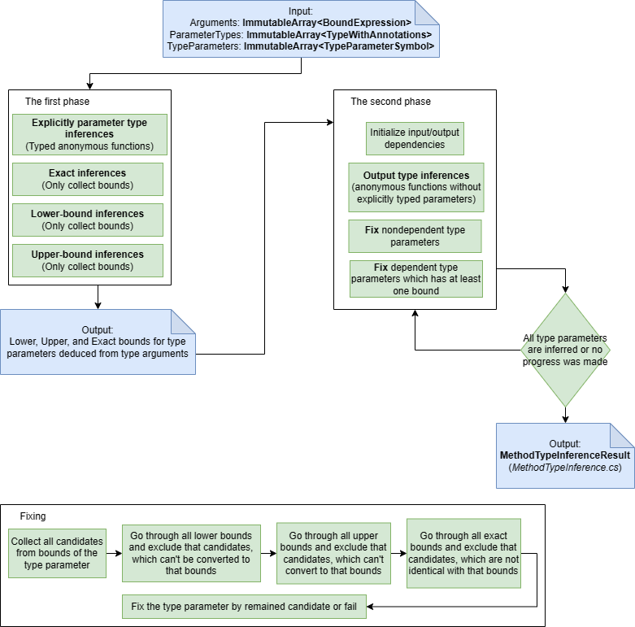

# Meeting notes

## What to discuss

- Show a prototype enabling constructor type inference + new method type inference
- Show current prototype, bounding type inferred arguments
- Present a way how to accomplish type inference of constructor including initializer lists, new type inferrer,...

### Previous prototype

- Added a new syntax node for inferred type argument -> It required to change the language parser (Bad idead)
- Then I handle the syntax in Binder and create SourceInferredTypeArgument
- Then I changed the type inferrer to be able to handle arbitrary set of constraints and enabling to infer the inferred type arguments and type parameters
- I added new type of bound `Shape` prohibiting to merge it with another type(It was problem of Exact bound when nullable occured).
- I added new constraints describing provided type arguments. It implied that bounds can contain type variables (SourceInferredTypeArgument)
- So I added new dependencies track this fact. And respect it during the fixing
- I modified adding new bound. When the added bound contained type variable or type variable was contained in already presented bounds -> we do an inference of these pairs.
- Then I changed binding of class constructor and constructor overload resolution to employ the new type inferrer.
- During nullability check, we had to add warning that type inference failed when nullable constraints were not satisfied.

What issues we found?

- `_` placeholder can appear as a type name -> We didn't respect that
- The inferrer was not ready for adding new constraints because the second phase id dependent on already fixed values which can be changed by new constraints

### Current prototype

- We used the same way as in `var` keyword. That means if we are in the situation(type argument list of method invocation or constructor) where `_` can be considered as a inferred type argument, we will do a lookup for that type name, if there is nothing, we will consider `_` be a inferred type argument. This will respect the 
- To be able to use the type inference multiple times, we want these features from type inferrer
  - It is able to do snapshots for rollbacking
  - It does the second phase only on demand because the second phase depends on fixed results.
  - It is able to add new constraints and type variables
  - It is able to check if the constaints holds, and if not, it can distinguish it. (constraint (int == string) shouldn't be valid). The current type inferred just seek for the bounds and then check the inferred type only against the bounds.
  - It needs be able to handle type variables in bounds -> we need to adjust adding new bounds, and doing infernece.
- We need to change binding of creation expression...

> Invocation expression binding

> Constructor expression binding

> Method type inference

> Improved invocation expression binding

> Improved constructor expression binding

> Improved method type inference 

> 