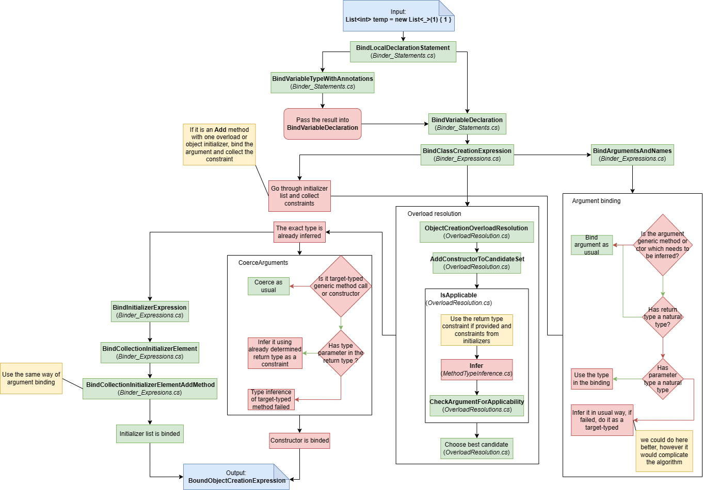

# Improving type inference

## Summary

Allow a user to specify only necessary type arguments of

1. Generic method or local function call
2. Generic object creation

by introducing the `_` placeholder to mark type arguments inferred by the compiler.

Introduces 

1. type inference using target type
2. type inference using initializer list
3. type inference using `where` clauses

of generic object creation.

## Motivation

The current method type inference works as an "all or nothing" principle. 
If the compiler is not able to infer command call type arguments, the user has to specify all of them. 
This requirement can be verbose, noisy, and unnecessary in cases where the compiler is able to infer almost all type arguments and need just to specify ambiguous ones. 
In these cases, we would like to give the compiler a hint for ambiguous type arguments. 
The current source of dependencies, which are used in type inference is restricted to method/function arguments which prevent making the whole type argument list inference in even simple scenarios. 
We could use the `_` placeholder for type arguments, which can be inferred from the argument list, and specify the remaining type arguments by ourselves. The potential additional sources of type information are specified below.

- **Inference by target type** - The current method type inference doesn't use target type for determining type arguments in type inference resulting in specifying the whole argument list.

```csharp
object person = ...
int age = person.GetFieldValue("Age"); // Error: T can't be inferred

public static class ObjectExtensions {
    public static T GetFieldValue<T>(this object target, string field) { ... }
}
```

- **Inference by `where` clauses** - Utilizing `where` clauses to determine the type argument.

```csharp
using System.Collections.Generic;

var element = Foo(new List<int>()); //Error: TElem can't be inferred

TElem Foo<TList, TElem>(TList p) where TList : IEnumerable<TElem> {...}
```

- **Inference by later interaction with the object** - Utilizing later method calls or assignments to determine the type of the generic object (useful for object creation).

```csharp
var number = new Complex {RealPart = 1, ImaginaryPart = true}; // Error: TReal and TImaginary can't be inferred

public class Complex<TReal, TImaginary> 
{
    public TReal RealPart {get; set;}
    public TImaginary ImaginaryPart {get;set;}
}
```

Introducing improved method type inference involving the features above would bring breaking changes into the next C# version which we try to avoid. 
Although, there can be a way in the future which would allow us to introduce breaking changes like this. 
So we would like to already observe what difficulties involve to introduce better type inference as we know from RUST or Haskell.

For the first problem we would like to replace unsufficient type inference by giving the compiler hints about ambiguous types and letting the compiler infer the obvious ones.

> An example

```csharp
var temp = ToCollection<List<_>, _>(1); // We are specifying the generic class, but its type argument can be inferred by the compiler

TList ToCollection<TList, TElem>(TElem p1) where TList : IEnumerable<TElem> {...}
```

The example is goal-directed and introducing `_` doesn't bring very much. However, imagine that the element would be a type with a long name. 
Or there can be more type arguments, which are obvious and only one needs to be specified. 
In these situations, `_` can save a lot of keystrokes.
In cases where `_` is a name of a type(very weird idea), we will prioritize it and turn the hints off for the method type inferrer.
And because we are introducing a new concept of `_`, we don't introduce a breaking change.

For the second part of the problem, we can introduce constructor type inference, where we can try improved type inference by adding new type constraints.
It would also bring a breaking change, however, we can enable it just in case of used angle brackets (e.g. `new Klass<...>()`).
Because constructor type inference is not presented in the current C# version, we are free to experiment with it, improve the inferrer and use it later when the method type inference would be ready for this change.
Reasons for adding constructor type inference remain the same, there are many types with more than 4 type parameters in the standard library and there are not necessary to specify all of them in the type argument list.

### Possible extensions

Worth to mention other options which could be accomplished in the future regarding default and named type arguments.
Having the `_` placeholder can be used as a shortcut for choosing the right generic overload and to save typing when we use named type parameters.

```csharp
class Foo<T1, T2 = int> {}
class Foo<T1, T2 = int, T3 = string> {}

new Foo<T3: _, T2: string, T1 = _>(); // Assuming that T1 can be inferred and T3 is default.
new Foo(T2: string)(); // T1 and T3 are defaults
new Foo<_,_>(); // Choosing Foo<T1, T2> based on the arity
```

Method type inference(including object creation) is not the only place where we can use the `_` placeholder.
Sometimes `var` keyword as a variable declaration is not sufficient. 
We would like to be able to specify more the type information about variable but still have some implementation details hidden.
With the `_` placeholder we would be able to specify more the shape of the variable avoiding unnecessary specification of type arguments. 

```csharp
Wrapper<_> wrapper = ... // I get an wrapper, which I'm interested in, but I don't care about the type arguments, because I don't need them in my code.
wrapper.DoSomething();
```
At the end, casting could use the `_` placeholder as well.

```csharp
Foo<int, string> myvar = (Foo<_,_>)myobject; // Hint the type arguments based on target or other potential source of type information like default or named type arguments.
```

An interesting thing would be to allow the `_` placeholder in member lookup as you can see in the example below.
On the first see, it can look wierd.

```csharp
static class C1<T1> {
    static class C2 <T2> {
        public (T1, T2) Foo(T1 t, T2 t) {}
    }
}

var a = C1<_>.C2<_>.Foo(1, 1);
```

But in combination with default parameters, It might be useful in cases, where we use entity as a global provider of something, which we determine by type.

```csharp
static class Factory<T = Default> {
    public static T Create(){...}
}

int a = Factory<_>.Create(); // Calls Factory<int>.Create();
var b = Factory<_>.Create(); // Calls Factory<Default>.Create();
```

Although it is unlikely that it would be added into C# because of implementation complexity and hard readebility of code.

## Scope

Partial type inference can be solved in various ways.
We chose a feature enabling to hint the compiler by specifying ambiguous type arguments and letting the compiler infer the rest.
It aims at cases, where we want just to specify the arity of desired generic method(type) or specify a parameter that is not possible to infer from the context but let the compiler infer the remaining arguments. Also, we prototyped to use more info about type dependencies in the type inference.

## Design

### Choosing the placeholder

We base our choice on the usages specified below.

1. Type argument list of generic method call (e.g. `Foo<T1, T2>(...)`)
2. Type argument list of type creation (e.g. `new Bar<T1, T2>(...)`)
3. Type argument list of local variable (e.g. `Bar<T1, T2> temp = ...`)
4. Expressing array type (e.g. `T1[]`)
5. Expressing inferred type alone `T1` in local variable

**Diamond operator**

1. In the case of generic method calls it doesn't much make sense since method type inference is enabled by default without using angle brackets.

```csharp
Foo<>(arg1, arg2, arg3); // Doesn't bring us any additional info
```

2. There is an advantage. It can turn on the type inference. However, it would complicate overload resolution because we would have to search for every generic type of the same name no matter what arity. But could make a restriction. Usually, there is not more than one generic type with the same name. So when there will be just one type of that name, we can turn the inference on.

```csharp
new Bar<>(); // Many constructors which we have to investigate for applicability
new Baz<>(); // Its OK, we know what set of constructors to investigate.

class Bar { ... }
class Bar<T1> { ... }
class Bar<T1, T2> { ... }

class Baz<T1,T2> {...}
```

3. It could make sense to specify just a wrapper of some type that gives us general API that doesn't involve its type arguments. It would say that the part of the code just cares about the wrapper. However, we think that it doesn't give us much freedom because type arguments usually appear in public API and only a few of them are for internal use. 

```csharp
Wrapper<> temp = ...
```

4. It doesn't seem very well.

```csharp
<>[] temp = ...
```

5. It clashes with `var` and looks wierd.

```csharp
<> temp = ... // equivalent to `var temp = ...`
```

**Whitespace seperated by commas**

1. It is able to specify the arity of the generic method. However, it seems to be messy when it is used in generic methods with many generic type parameters. Also, it already has its own meaning of expressing open generic type.

```csharp
Foo<,string,List<>,>(arg1, arg2, arg3);
```

1. The same reasoning as above.

```csharp
new Bar<,string,List<>,>(arg1, arg2) { arg3 };
```

3. It doesn't work with array type.

```csharp
Bar<,string,List<>,> temp = ...
```

4. It doesn't seems very well.

```csharp
[] temp = ...
Foo<,[],>(arg1, arg2)
```

5. It looks like CSharp would not be a statically-typed language, clashed with `var` and probably introduce many implementation problems in the parser.

```csharp
temp = ...
```

**_ seperated by commas**

1. It specifies the arity of the generic method. It explicitly says that we want to infer this type argument. It seems to be less messy.

```csharp
Foo<_, string, List<_>, _>(arg1, arg2, arg3);
```

2. The same reasons as above.

```csharp
new Bar<_, string, List<_>, _>(arg1, arg2, arg3);
```

3. The same reasons as above.

```csharp
Bar<_, string, List<_>, _>(arg1, arg2);
```

4. Looks quite OK.

```csharp
_[] temp = ...
```

5. Clashes with `var` and seems to be wierd.

```csharp
_ temp = ...
```

**var seperated by commas**

1. More keystrokes. It starts to raise the question if it brings the advantage of saving keystrokes.

```csharp
Foo<var, string, List<var>, var>(arg1, arg2, arg3);
```

2. The same reasons as above

```csharp
new Bar<var, string, List<var>, var>(arg1, arg2, arg3);
```

3. The same reasons as above.

```csharp
Bar<var, string, List<var>, var>(arg1, arg2);
```

1. Looks OK.

```csharp
var[] temp = ...
```

5. State of the art.

```csharp
var temp = ...
```

**Something else seperated by commas**

Doesn't make a lot of sense because it needs to assign new meaning to that character in comparison with `_`, `var`, `<>`, `<,,,>`. 
Asterisk `*` can be considered, however, it can remind a pointer.  

**Conslusion**

I prefer `_` character with enabling `<>` operator in the case of constructor inference when there is only one generic type with that name. 
Additionally to that, I would prohibit using `_` in the same places as `var`.

### Nullable Annotation

Since we have nullable analysis, we could permit to specify nullability like this `_?`. 
However, we don't think it would have any significant benefits.

### Partial method type inference

For every generic method or function call, we will enable to use `_` as a placeholder for inferred type if there is no type of that name.
The placeholder can be nested (e.g. `G<_, List<_>>`).
The power of type inference remains the same.

**Implementation**

1. Detecting inferred type arguments

We will treat `_` in the same way as `var` keyword. 
We will make a special symbol `SourceInferredTypeArgumentSymbol`.
When we will bind an invocation expression, we will specially treat the `_` placeholder. 
During the investigation of the method's simple name, if the lookup doesn't find any type symbol, we will create `SourceInferredTypeArgumentSymbol` instead of raising an error of an unknown type name.
It will prioritize usage of `_` as a type name (type parameter name, struct, or class name) instead of treating it as `SourceInferredTypeArgumentSymbol` which will doesn't change the behavior of code compiled by a previous version of the compiler.  

2. Conditions for type inference

So we have a type argument list and enter the overload resolution. 
We want to infer type parameters if the method is generic, its argument list doesn't contain any dynamic argument and doesn't have a type argument list or the type argument list contains `SourceInferredTypeArgumentSymbol`. 
It doesn't matter how nested it is. We don't have to check if the receiver is dynamic because there is no overload resolution in that case.

3. Type inference

A description of type inference will be presented in the type inference of constructors.

4. Checking generic method calls or functions involving `dynamic` keyword 

Type arguments, which don't contain any `SourceInferredTypeArgumentSymbol` (even nested), are substituted in parameter lists. 
Those parameters, which don't contain any type parameter, are checked with corresponding arguments. Checking involves respecting the type parameters' constraints and applicability of arguments. 

5. Nullable analysis.
   
The condition for entering into type inference is similar to the second point. 
We have to bind the type arguments again with information about nullability and run the inference in the same manner as the current version of the compiler with an adjusted type inferrer which will be described later.

**Examples**

> Common use cases

```csharp
// Inferred: [TCollection = List<MySuperComplicatedElement<Arg1, Arg2>>, TElem = MySuperComplicatedElement<Arg1, Arg2>]
// Use case: Specifying a type of collection because other arguments can be inferred. Sometimes, the `where` constraints are crucial for the type inference. In that case, we will use the hint because type inference is not so powerful.
var temp1 = ToCollection<List<_>, _>(new MySuperComplicatedElement<Arg1, Arg2>()); 
// Inferred: [TResult = MyResult, TAlgorithm = MyAlg, TOptions = MyAlgOpt, TInput = MyInput]
// Use case: Most of the type arguments can be inferred from arguments. Sometimes the return type contains a type parameter as well and it can be crucial for the type inference. In that case, we will use the hint because type inference is not so powerful.
MyResult temp2 = Run<_,_,_,MyResult>(new MyAlg(), new MyAlgOpt(), new MyInput());
// Inferred: [TPressision = double]
// Use case: Type parameters can be used for internal usage. In that case, we would like to provide the compiler hint.
Result temp3 = Computation<double, _, Result, _>(new Data(), new Opts());

// Definitions
TCollection ToCollection<TCollection, TElem>(TElem p1) where TCollection : IEnumerable<TElem> { ... } 
TResult Run<TAlgorithm, TOptions, TInput, TResult>(TAlgorithm alg, TOptions opts, TInput input) { ... }
Result Computation<TPressision, TData, TResult, TOpts>(TData data, TOpts opts) { ... } 
```

> Tests

```csharp
F1<_, string>(1); // Inferred: [T1 = int, T2 = string] Simple test
F2<_,_>(1,""); // Inferred: [T1 = int, T2 = string] Choose overload based on arity
F3<int, _, string, _>(new G2<string, string>); // Inferred: [T1 = int, T2 = string, T3 = string, T4 = string] Constructed type
F4<_, _, string>(x => x + 1, y => y.ToString(),z => z.Length); // Inferred: [T1 = int, T2 = int, T3 = string] Circle of dependency
F5<string>(1); // Inferred: [T1 = string] Expanded form #1
F5<_>(1, ""); // Inferred: [T1 = string] Expanded form #2
F5<_>(1, "", ""); // Inferred: [T1 = string] Expanded form #3

B1<int> temp1 = null;
F6<A1<_>>(temp1); // Inferred: [ T1 = A1<int> ] Wrapper conversion

B2<int, string> temp2 = null;
F6<A2<_, string>>(temp2); // Inferred: [ T1 = A2<int, string> ] Wrapper conversion with type argument

C2<int, B> temp3 = null;
F6<I2<_, A>>(temp3); // Inferred: [ I2<int, A> ] Wrapper conversion with type argument conversion

dynamic temp4 = "";
F7<string, _>("", temp4, 1); // Inferred: [T1 = int] Error: T1 = string & int
F7<_, string>(1, temp4, 1); // Inferred: [T1 = int] Warning: Inferred type argument is not supported by runtime (type hints will not be used at all)
temp.F7<string, _>(temp4);  // Inferred: [T1 = int] Warning: Inferred type argument is not supported by runtime (type hints will not be used at all)

F1<_,_>(""); // Error: Can't infer T2
F1<_,int>(""); // Error: Can't infer T2
F1<_,byte>(257); // Error: Can't infer T2

#nullable enable
string? temp5 = null;
string temp6 = "";
C2<int, string> temp7 = new C2<int, string>();
C2<int, string?> temp8 = new C2<int, string?>();
C2<string, int> temp9 = new C2<string, int>();

F8<int, _>(temp5); // Inferred: [T1 = int, T2 = string!] 
F8<int, _>(temp6); // Inferred: [T1 = int, T2 = string!] 
F8<int?, _>(temp5); // Inferred: [T1 = int?, T2 = string!] 
F8<int?, _>(temp6); // Inferred: [T1 = int?, T2 = string!] 
F9<int, _>(temp5); // Inferred: [T1 = int, T2 = string?] 
F9<int, _>(temp6); // Inferred: [T1 = int, T2 = string!] 
F9<int?, _>(temp5); // Inferred: [T1 = int?, T2 = string?] 
F9<int?, _>(temp6); // Inferred: [T1 = int?, T2 = string!] 


F10<I2<_, string?>>(temp7); // Inferred: [T1 = I2<int, string?>!] Can convert string to string? because of covariance
F10<C2<_, string?>>(temp7); // Error: Can't convert string? to string because of invariance
F10<I2<_, _>>(temp7); // Inferred: [T1 = I2<System.Int32, System.String!>!]
F10<C2<_, _>>(temp7); // Inferred: [T1 = C2<System.Int32, System.String!>!]
F10<I2<_, _>>(temp8); // Inferred: [T1 = I2<System.Int32, System.String?>!]
F10<C2<_, _>>(temp8); // Inferred: [T1 = C2<System.Int32, System.String?>!]
F10<I2<_, string>>(temp8); // Error: Can't convert string? to string because of covariance
F10<C2<_, string>>(temp8); // Error: Can't convert string? to string because of invariance
F10<I2<string?, int>>(temp9); // Inferred: [T1 = C2<System.Int32, System.String?>!] Can convert string to string? because of contravariance

void F8<T1, T2>(T2? p2) { }
void F9<T1, T2>(T2 p2) { }
void F10<T1>(T1 p1) {}
#nullable disable

//Definitions
void F1<T1, T2>(T1 p1) {}
void F2<T1, T2>(T1 p1, T2 p2) {}
void F2<T1>(T1 p1, string p2) {}
void F3<T1, T2, T3, T4>(G2<T2, T4> p24) {}
class G2<T1, T2> {}
void F4<T1, T2, T3>(Func<T1, T2> p12, Func<T2, T3> p23, Func<T3, T1> p31) { }
void F5<T>(int p1, params T[] args) {}
void F6<T1>(T1 p1) {}
class A {}
class B : A{}
class A1<T> {}
class A2<T1, T2> {}
class B1<T> : A1<T> {}
class B2<T1, T2> : A2<T1, T2> {}
interface I2<in T1, out T2> {}
class C2<T1, T2> : I2<T1, T2> {}
void F7<T1, T2>(T1 p1, T2 p2, T1 p3) {}
void F11<T1, T2>(T2 p2) { }

//Seperated Assembly
F1<_> (null); // Inferred: [T1 = _] class `_` turned the inference off

F1<T1>(T1 p1) {}
class _ {}
```

### Type inference of constructor

As we mentioned in the motivation, we will experiment with improving type inference in object creation.
The inference will influence following expressions.

1. Object creation
2. Array creation

Beside mentioned partial type inference, we will include information about target type and initializer list together with type parameter constraints.

**Implementation**

1. Detecting inferred arguments

We will treat `_` in the same way as in the method type inference.
Special handling of `_` will be turned on when we will bind `ClassCreationExpression` or `ArrayExpressionExpression`. 
That means, we will not support it in the `DelegateCreationExpression`.

2. Conditions for type inference

The inference is entered when there is an empty type argument list (diamond operator`<>`), or type argument list contains `SourceInferredTypeArgumentSymbol`.

3. Checking constructor call involving `dynamic` keyword 

Type arguments, which don't contain any `SourceInferredTypeArgumentSymbol` (even nested), are substituted in parameter lists. 
Those parameters, which don't contain any type parameter, are checked with corresponding arguments. Checking involves respecting the type parameters' constraints and applicability of arguments. 

4. Array type inference

We change the best common type of set of expressions by adding new constraints from type argument list of array creation (e.g. `new G<_>[] {...}`, `G<_>` is added to the set of bounds(We will describe how to handle `_` and in which bounds should be `G<_>` in the description of constructor type inference)).
We also add constraints from the target type (e.g. `IEnumerable<int> temp = new [1]`, Do upper bound inference of `IEnumerable<int>` and `T[]`).
This will ensure, that type information from the target and type argument list is added to the inferrer.
We don't have to care about the constructor and `where` clauses because they don't help us to find type argument and the initializer is already used in the best common type algorithm.

5. Passing information about target type

For the rest of the points, we will use the following diagram to better describe the process.

> Object creation binding



Information about the target can come from two places. 
The first place is `VariableDeclarationStatement`. 
In that case, we bind the variable if we can (e.g. it is not `var`) and pass it to the binding of the declarator expression. The second place can be parameter type. 
This case is tricky. There are three possible scenarios. 
We already know the type of the parameter (It doesn't contain any type parameters). We don't know the type of the parameter because it contains the type parameter, although, after the inference, we will know it. 
And the last option is when type inference fails and doesn't find type arguments. 
We will describe how the target type is passed in these scenarios in the following paragraphs. 

6. Binding arguments

There can be situations when the argument is another object creation expression that needs type inference.
At the time, we would like to know parameter types in order to pass them into the binding process. 
We can do it by postponing the binding of `ObjectCreationExpression`s and `ArrayCreationExpression`s to the time when we start to investigate each of the constructor candidates. 
At that time we already have an exact list of the parameters. 
Let's do that. 
In the binding process before constructor overload resolution, we will convert above mentioned expression into `BoundUnconvertedObjectCreationExpression` and `BoundUnconvertedArrayCreationExpression`. 
When we arrive in front of checking the applicability of the constructor(before type inference). 
We will look at the appropriate type of parameters and do the following. 
If the argument has the type of "BoundUnvonverted" expressions and the type of parameter doesn't contain a type parameter, bind the expression by passing the info about the target. 
Otherwise, try to bind it without info about the target type, if it succeeds, use the type in further inference, if not, wait after the inference. 
It can happen, that the inference still succeeds and we can try to bind the argument again with an already determined type of target. 

> Note: We could do here better and use info about the target even if we don't know the exact type. 
> However, it would complicate the algorithm because of overloads. 
> So we propose a simplier alternative, which still has benefits in common use cases.

7. Getting information from initializer

This step is a little bit complicated because of method overloads. 
If it is a collection initializer and there is more than one overload of `Add` method, we don't know which parameter type constraint to use till its overload resolution. 
However, we think having overloads of `Add` method is not very common. 
So we could do the following. 
If it is an Object initializer, Array initializer, collection initializer with only one method `Add` or collection initializer using an indexer with only one indexer, we will collect the argument type constraints. 
Because in that case, we know that are not any other possible constraints that should hold. 
So we will go through all initializers and if the initializer parameter type contains a type parameter, we collect the argument types constraint in the same manner as in the constructor argument list.

8.  Coercing arguments

After we infer the type parameters and choose the right constructor, we have to try to bind "UnconvertedExpressions" again with target type info and convert it into proper bound nodes.

9.  Bindining initializer list

Then we proceed as usual to bind the initializer list.

10.  Constructor inference

> Type inference

 

We will extend the API to enable obtaining info about target type, type argument hints (e.g. `Foo<_, G<_>, int>()`), and parameter constraints from initializers (e.g. `Add(T p1)`, `Bar<_> {1,2}` so the constraint will be `int = T`) 

We will also create another type of type variable which would be `SourceInferredTypeArgumentSymbol` and treat it in the same manner as with type parameters. 
We introduce a new bound of type `Shape` which doesn't allow to be converted into different type (e.g. `string` shouldn't be permitted to be converted to `string?`).
 And we add type arguments to the corresponding shape bound of the type parameter. 
 
 Because from now on the bounds can contain unfixed type variables. 
 We introduce two new types of dependencies. 
 The first one is `TypeVarDependency` which holds the info if a given type variable contains another given type variable in its bounds(excluding shape bound). 
 The second dependency is `ShapeVarDependency` and it's the same for the shape bound.

We then run the first phase as usual. 
When we enter `AddBound` moment, we have to be careful here. 
The adding bound can contain a type variable or already inferred bounds can contain a type variable.
We want to propagate these type dependencies to their bounds.
So for each bound containing a type variable, we will run the inference with the currently added bound(Already collected bouns will be targets, and the adding bound will be a source).
If the adding bound also contains a type variable, we will do the inference for each bound(The adding bound will be a target and the bounds will be sources). 
We will respect the kind of bonds in inferences. 
It can happen that we will have a type variable on both sides of the constraint. 
In that case, we will ignore the type variables in the source and just skip it. 
We don't lose the dependency because we run the inferences for each pair containing the type variable in the source.

During the second phase, we have to be careful about dependencies. We can't fix a type variable that is `ShapeVarDependent` on an unfixed type variable. 
Although we will allow fixing type variable which is  `TypeVarDependent` on another type variable but has at least one bound which doesn't contain any unfixed type variables. 
We will allow it only in a moment when there will not be any unfixed type variable that is not dependent. This will solve situations, where there is a circular dependency between type variables, but there are also other sources of type info that can "break" this circle.

Fixing is done in the usual way with one exception. When the type variable has a shape bound. We have to keep the type exactly the same and just check if it is ok with other constraints.

After the Type inference, we receive inferred type parameters

11. Nullable analysis

Because in the current C# version, there is no constructor overloading, there is no need for rewriting the types generated from constructors.
However, now it can happen that the inference infers some different type(with different nullability, or failed because of that).
In this situation, we have to rewrite the type generated by the constructor if the constructor type inference found a type differing from the previous type inference.

**Examples**

> Common use cases

```csharp
using System.Collections.Generic;

// Inferred: [T = int] Assuming that there are no other generic type with `List` name
// Use case: We want to determine the type of the element by the initializer list.
var temp1 = new List<>{ 1, 2, 3}; 

// Inferred: [TKey = string, TValue = int]
// Use case: Doesn't matter how the add method looks like
var temp2 = new Dictionary<_,_>{ {"key", 1} };

// Inferred: [T = int]
// Use case: Type parameters can be determinded by target type
IEnumerable<int> temp2 = new List<>();

// Inferred: [Tuple<string, int>[]]
// Use case: Information about target type can be "forwarded" into the nested expressions
IEnumerable<Tuple<string, int>> temp3 = new[] { new("",1 ) };

// Inferred: [T = int]
// Using type hints in type argument list
new C1<_>[] {new C2<int>()};

// Inferred: [T = int]
// Use case: Information about the target is propagated even in generic calls
Foo(new List<>(), 1);

//Inferred: [TKey = string, TValue = int]
// Use case: Using indexers to determine type parameters
var temp4 = new Dictionary<_,_>()
{
    ["foo"] = 34,
    ["bar"] = 42
};

// Inferred: [TCollection = List<int>, TElem = int]
// Use case: Using where constraint to determine other type parameters.
var temp5 = new Bag<_,_>(new List<int>());

// It is possible to combile info from several soruces (target type, initializer list, type arguemnt list, constructor, where constraint)

//Declarations
class Dictionary<T1, T2, T3> {}
void Foo<T>(IEnumerable<T> p1, T p2) {}
class Bag<TCollection, TElem> where TCollection : IEnumerable<TElem>
{
    public Bag(TCollection collection) {}
}
```

> Tests

> Similar to Method type inference

```csharp
new C1<_, string>(1); // Inferred: [T1 = int, T2 = string] Simple test
new C2<_,_>(1,""); // Inferred: [T1 = int, T2 = string] Choose overload based on arity
new C3<int, _, string, _>(new G2<string, string>); // Inferred: [T1 = int, T2 = string, T3 = string, T4 = string] Constructed type
new C4<_, _, string>(x => x + 1, y => y.ToString(),z => z.Length); // Inferred: [T1 = int, T2 = int, T3 = string] Circle of dependency
new C5<string>(1); // Inferred: [T1 = string] Expanded form #1
new C5<_>(1, ""); // Inferred: [T1 = string] Expanded form #2
new C5<_>(1, "", ""); // Inferred: [T1 = string] Expanded form #3

B1<int> temp1 = null;
new C6<A1<_>>(temp1); // Inferred: [ T1 = A1<int> ] Wrapper conversion

B2<int, string> temp2 = null;
new C6<A2<_, string>>(temp2); // Inferred: [ T1 = A2<int, string> ] Wrapper conversion with type argument

C2<int, B> temp3 = null;
new C6<I2<_, A>>(temp3); // Inferred: [ I2<int, A> ] Wrapper conversion with type argument conversion

dynamic temp4 = "";
new C7<string, _>("", temp4, 1); // Inferred: [T1 = int] Error: T1 = string & int
new C7<_, string>(1, temp4, 1); // Inferred: [T1 = int] Warning: Inferred type argument is not supported by runtime (type hints will not be used at all)

F1<_,_>(""); // Error: Can't infer T2
F1<_,int>(""); // Error: Can't infer T2
F1<_,byte>(257); // Error: Can't infer T2

#nullable enable
string? temp5 = null;
string temp6 = "";
GC2<int, string> temp7 = new GC2<int, string>();
GC2<int, string?> temp8 = new GC2<int, string?>();
GC2<string, int> temp9 = new GC2<string, int>();

new C8<int, _>(temp5); // Inferred: [T1 = int, T2 = string!] 
new C8<int, _>(temp6); // Inferred: [T1 = int, T2 = string!] 
new C8<int?, _>(temp5); // Inferred: [T1 = int?, T2 = string!] 
new C8<int?, _>(temp6); // Inferred: [T1 = int?, T2 = string!] 
new C9<int, _>(temp5); // Inferred: [T1 = int, T2 = string?] 
new C9<int, _>(temp6); // Inferred: [T1 = int, T2 = string!] 
new C9<int?, _>(temp5); // Inferred: [T1 = int?, T2 = string?] 
new C9<int?, _>(temp6); // Inferred: [T1 = int?, T2 = string!] 


new C10<I2<_, string?>>(temp7); // Inferred: [T1 = I2<int, string?>!] Can convert string to string? because of covariance
new C10<C2<_, string?>>(temp7); // Error: Can't convert string? to string because of invariance
new C10<I2<_, _>>(temp7); // Inferred: [T1 = I2<System.Int32, System.String!>!]
new C10<C2<_, _>>(temp7); // Inferred: [T1 = C2<System.Int32, System.String!>!]
new C10<I2<_, _>>(temp8); // Inferred: [T1 = I2<System.Int32, System.String?>!]
new C10<C2<_, _>>(temp8); // Inferred: [T1 = C2<System.Int32, System.String?>!]
new C10<I2<_, string>>(temp8); // Error: Can't convert string? to string because of covariance
new C10<C2<_, string>>(temp8); // Error: Can't convert string? to string because of invariance
enw C10<I2<string?, int>>(temp9); // Inferred: [T1 = C2<System.Int32, System.String?>!] Can convert string to string? because of contravariance

class C8<T1, T2>
{
    public C8(T2? p2) { }
}
class C9<T1, T2>
{
    public C9(T2 p2) { }
}
class C10<T1>
{
    public C10(T1 p1) {}
}
#nullable disable

//Definitions
class C1<T1, T2> 
{
    public C1(T1 p1) {}
}
class C2<T1, T2> 
{
    public C2(T1 p1, T2 p2) {}
}
class C2<T1> 
{
    public C2(T1 p1, string p2) {}
}
class C3<T1, T2, T3, T4> 
{
    public C3(G2<T2, T4> p24) {}
}
class G2<T1, T2> {}
class C4<T1, T2, T3>
{
    public C4(Func<T1, T2> p12, Func<T2, T3> p23, Func<T3, T1> p31) {}
}
class C5<T1> 
{
    public C5(int p1, params T1[] args) {}
}
class C6<T1> {
    public C6(T1 p1) {}
}
class A {}
class B : A{}
class A1<T> {}
class A2<T1, T2> {}
class B1<T> : A1<T> {}
class B2<T1, T2> : A2<T1, T2> {}
interface I2<in T1, out T2> {}
class GC2<T1, T2> : I2<T1, T2> {}
class C7<T1, T2> 
{
    public C7(T1 p1, T2 p2, T1 p3) {}
}
class C11<T1, T2> 
{
    public (T2 p2) { }
}

//Seperated Assembly
new C1<_> (null); // Inferred: [T1 = _] class `_` turned the inference off

class C1<T1> 
{
    C1(T1 p1) {}
}
class _ {}
```

> Target-typed, Constrains, Initializers

```csharp
using System.Collections.Generic;
// Inferred: [T = int]
// Target type(type of variable declaration) is passed to type inference of constructor
C1<int> temp1 = new C2<_>();

// Inferred: [T = int]
// Target type is passed to type inference of constructor after overload resolution of `F1<T>`
F1(new C2<_>(), 1);

//Inferred: [T = int]
//It works for constructors and initializers as well
new C3<_>(new C2<_>(), 1);

// Inferred: [T = int] 
IEnumerable<int> temp2 = new[1];

//Inferred: [T = C2<int>]
IEnumerable<C1<int>> temp3 = new C2<_>[1];

// Inferred: [T1 = C1<int>, T2 = int]
// Using constraints to determine type parameters
new C4<_,_>(1);

// Inferred: [T1 = int, T2 = string]
// Using Object intializer list to determine type parameters
new C5<_,_> {Prop1 = 1, Prop2 = ""}; 

//Inferred: [T1 = 1, T2 = string]
//Using Collection Initializer list to determine type parameters
new C6<_,_> {{1, ""}};

// Error: Can't infered because Add method has overloads.
new C7<_,_> {1, "" }; 

//Inferred: [T1 = int, T2 = string]
// Using indexers to determine type parameters
new C8<_,_> 
{
    ["A"] = 1;
};

// Inferred: [T1 = int, T2 = int, T3 = int, T4 = int, T5 = int, T = int]
// Combinining type constraints from target, constructor, type argument list, object initializer and where clause to determine type of parameters
F1(new C9<_,_,_,int,_>(1) {Prop1 = 1},1);

class C1<T> {}
class C2<T> : C1<T> {}
void F1<T>(C1<T> p1, T p2) {}
class C3<T>
{
    public C3(C1<T> p1, T p2) {}
}
class C4<T1, T2> where T1 : C1<T2> 
{
    public C4(T2 p1) {}
}
class C5<T1, T2>
{
    public T1 Prop1 {get;set;}
    public T2 Prop2 {get;set;}
}
class C6<T1, T2> : IEnumerable 
{
    ...
    public void Add(T1 p1, T2 p2) {} 
}
class C7<T1, T2> : IEnumerable
{
    ...
    public void Add(T1 p1) {}
    public void Add(T2 p2){}
}
class C8<T1, T2>
{
    public T1 this[T2 p1] {get {throw new NotImplementedException();} set {throw new NotImplementedException();}}
}
class C9<T1, T2, T3, T4, T5> : C1<T3> where T5 : C1<T4>
{
    public C9(T1 p1) {}
    public T2 Prop1 {get;set;}
}
``` 